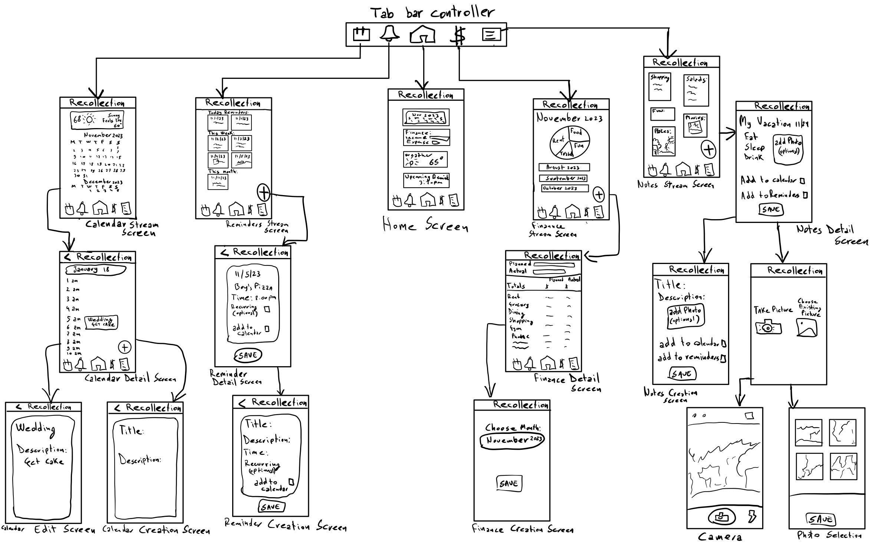
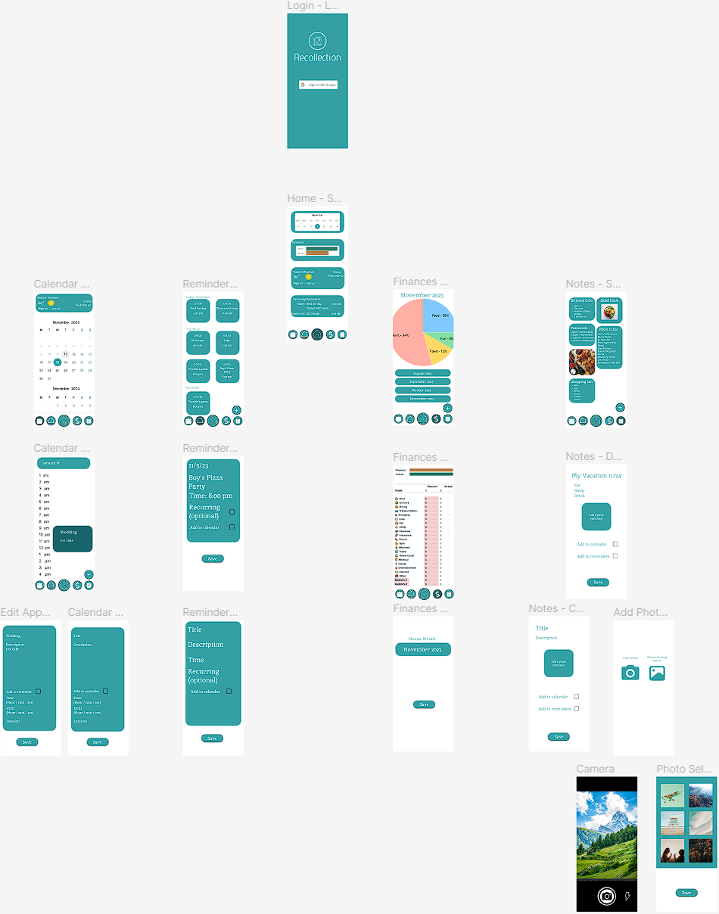
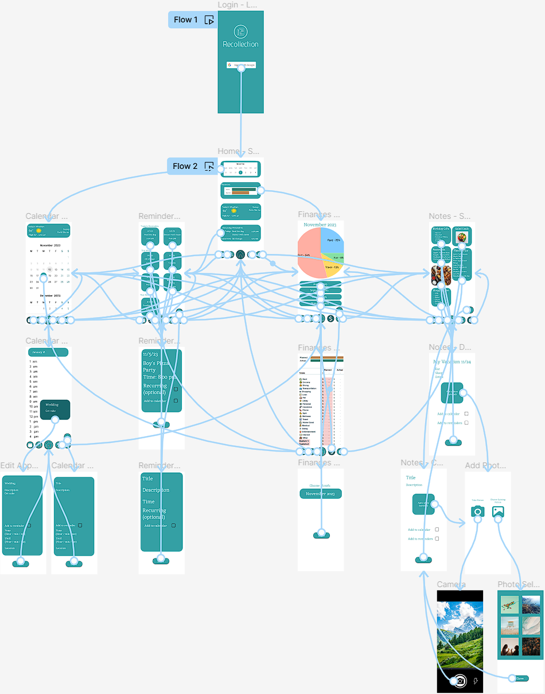
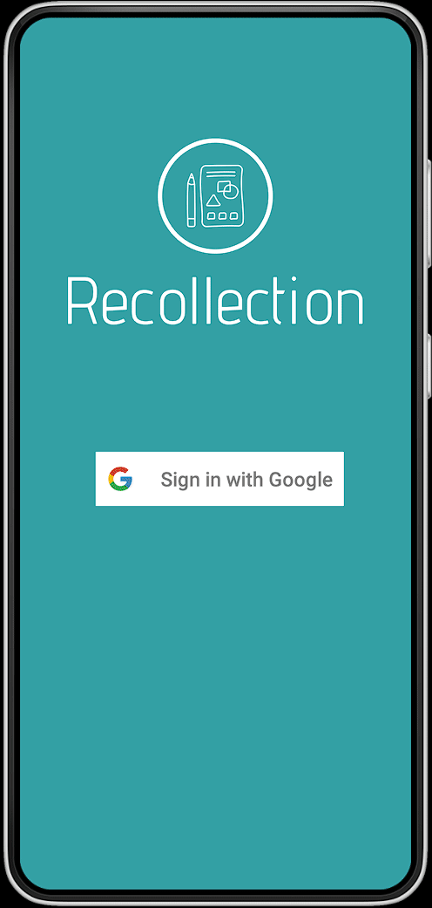
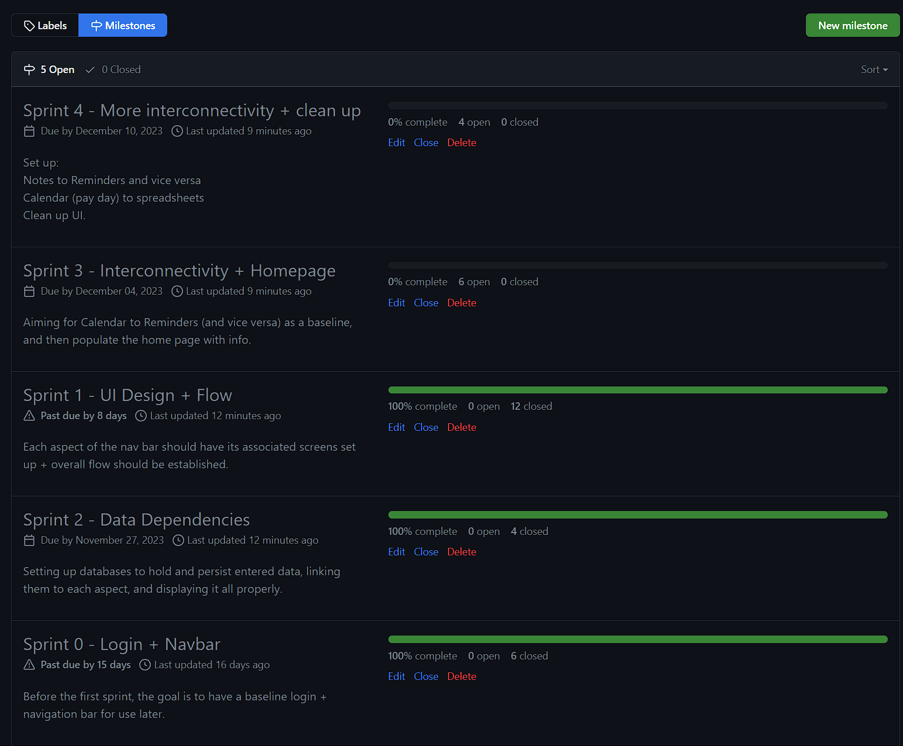
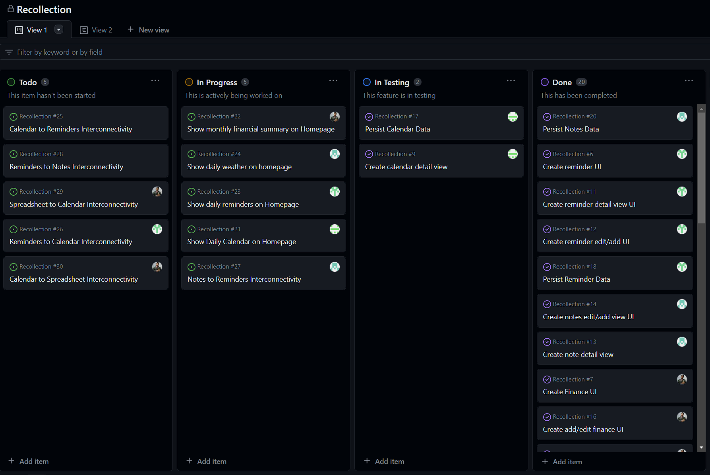
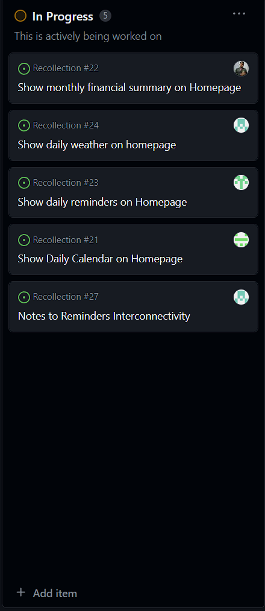
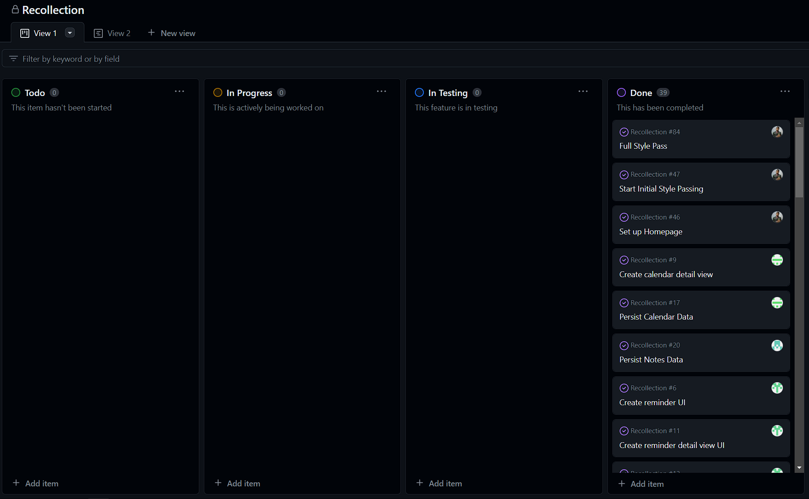

# Milestone 1 - Recollection (Unit 7)

## Table of Contents

1. [Overview](#Overview)
1. [Product Spec](#Product-Spec)
1. [Wireframes](#Wireframes)

## Overview

### Description

There doesn't seem to exist an app that combines notes, reminders, your calendar, & spreadsheets all in one place. The idea is to essentially fill that gap and make a one-stop shop for users to store their data across all four of those things. Calendar can cover any deadlines you might have. Notes can cover things like regular lists, images, map locations, and so on and so forth. Reminders can be things you add to then be reminded about through push notifications. Last but not least, spreadsheets let you do budgets & finances more officially.

### App Evaluation
- **Mobile**: It's more than a website because it links most of its aspects to work together. On top of that, the Notes can implement many aspects including images and map markers.  
- **Story:** There doesn't exist an app that currently combines finance management, calendar, reminders, as well as notes in one easy to access place. This app could fill that gap and be the one stop shop for everything relating to reminders and notes.
- **Market:** Essentially any user that wants to manage their finances alongside their calendar as well as recorded notes.
- **Habit:** At the very least, it should at least be monthly. But the frequency of use really depends on how much information the user wants to keep track of. It will include "your day at a glance," so daily use is not out of the picture.
- **Scope:** Each version will essentially be one major feature. As the features are built, so will the links between them. i.e. the calendar should connect to the reminders. A stripped down version is still interesting to build because it should still be useful.

## Product Spec

### 1. User Features (Required and Optional)

**Required Features**

1. Spreadsheet functionality to track finances.
2. Notes functionality to keep record of various items:
    - Text
    - Todo Lists
    - Images (Capture or Insert)
    - Connectivity between notes to calendar and reminders.
3. Calendar functionality to track events.
    - Connectivity between calendar events going to reminders. 
4. Reminders functionality to get push notifications for inserted items.
    - Connectivity between reminders to calendar. 
6. Login with Google
7. Your day at a glance -- info from all four aspects as home screen.

**Optional Features**

1. Weather for your day at a glance.
2. Connectivity between spreadsheets and the other three aspects.
3. Notes functionality to integrate map markers/locations as a note item.
4. Connectivity between notes map marks to calendar.
5. Settings Screen (just for dark mode).
6. Layout Responsivity

### 2. Screen Archetypes

- **Login/Register Screen**
    - Login MUST happen with a Google account.
- **Stream**
    - Your day at a glance. (Initial Screen)
    - Calendar
    - Reminders
    - Spreadsheets
    - Notes
- **Detail**
    - Going into a specific note
    - Going into a specific reminder
    - Going into a specific spreadsheet
    - Going into a specific calendar event.
- **Creation**
    - Adding a new note.
    - Creating a new spreadsheet.
    - Creating a new calendar event.
    - Creating a new reminder.

### 3. Navigation

**Tab Navigation** (Tab to Screen)

* Home
* Calendar
* Reminders
* Spreadsheets
* Notes

**Flow Navigation** (Screen to Screen)

- Login Screen
    - => Your day at a glance (Home screen)
- Stream Screen
    - => Detail Screen
    - => Creation Screen
- Detail
    - => Back to Stream
- Creation
    - => Back to Stream

## Wireframes

 

 

### [BONUS] Digital Wireframes & Mockups

### [BONUS] Interactive Prototype

<!-- Replace this with whatever GIF tool you used! -->
GIF created with [ShareX](https://getsharex.com/). 

 

# Milestone 2 - Build Sprint 1 (Unit 8)

## GitHub Project board

## Issue cards

## Issues worked on this sprint

- Set up Login with Google Account
- Create Navbar
- Create a basic home screen for when the user logs in
- Create fragment for each element in the nav bar
- Create Calendar UI
- Create reminder UI
- Create Finance UI
- Create Notes UI
- Create calendar detail view
- Create add/edit Calendar screen UI
- Create reminder detail view UI
- Create reminder edit/add UI
- Create note detail view
- Create notes edit/add view UI
- Create Finance detail view
- Create add/edit finance UI
- Persist Calendar Data
- Persist Reminder Data
- Persist Notes Data
- Create Add/Detail Fragment Template
- Create Settings Activity

 

# Milestone 3 - Build Sprint 2 (Unit 9)

## GitHub Project board

## Completed user stories

- Set up Homepage
- Start Initial Style Passing
- Show Daily Calendar on Homepage
- Show daily reminders on Homepage
- Show monthly financial summary on Homepage
- Show daily weather on homepage
- CalendarView Bug Fixes
- Implement Reminders Push Notifications
- Calendar To Notes Interconnectivity
- Notes to Calendar Interconnectivity
- Notes to Reminders Interconnectivity
- Reminders to Notes Interconnectivity
- Reminders to Calendar Interconnectivity
- Calendar to Reminders Interconnectivity
- Spreadsheet to Calendar Interconnectivity
- Calendar to Spreadsheet Interconnectivity
- Full Style Pass

## Cut user stories

- Google Calendar Integration
- Google Sheets Integration
- Layout Responsivity
- Map Markers
- Dark Mode

## App Demo Video

- Embed the YouTube/Vimeo link of your Completed Demo Day prep video
